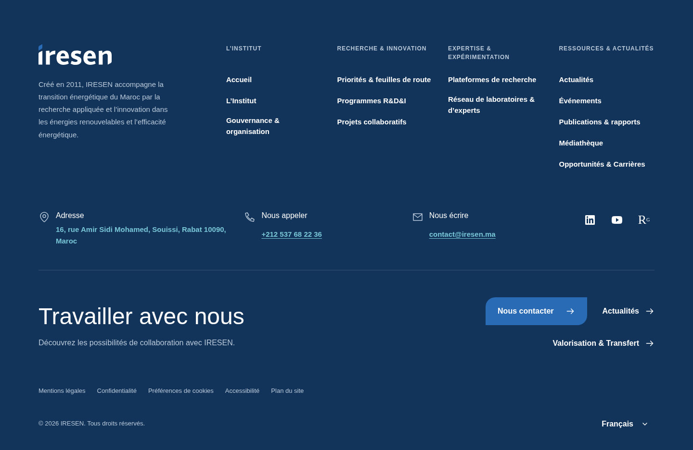
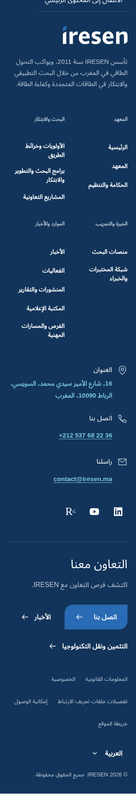
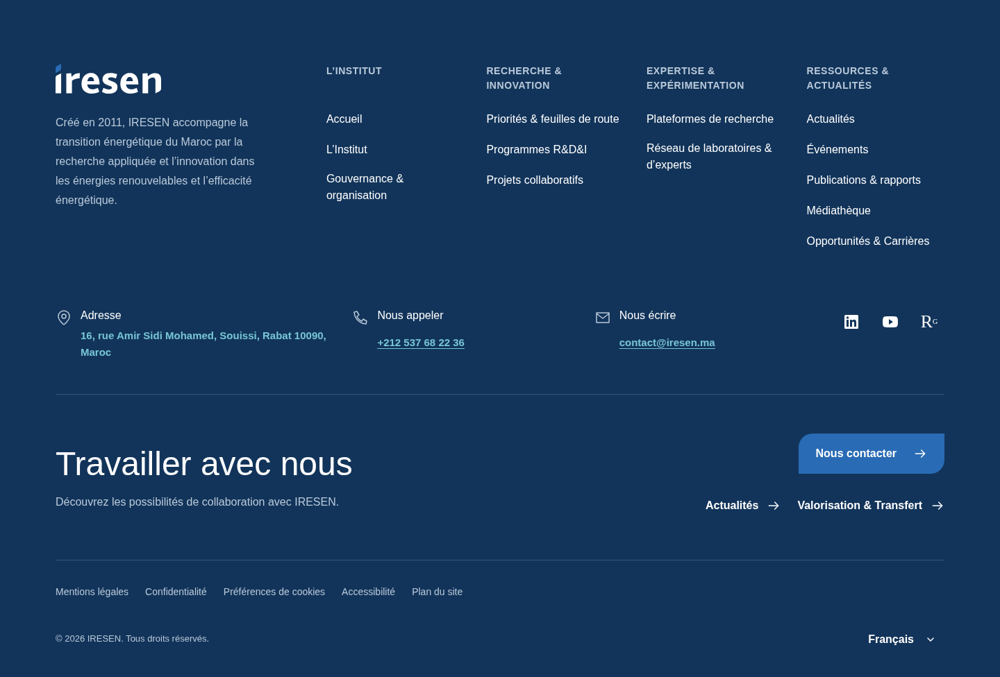
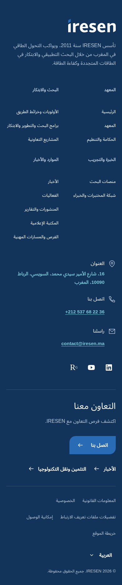
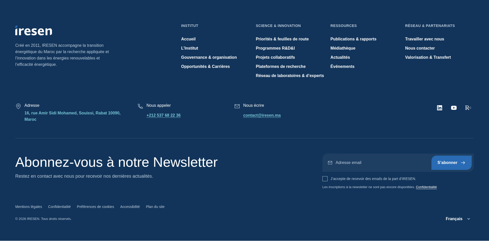
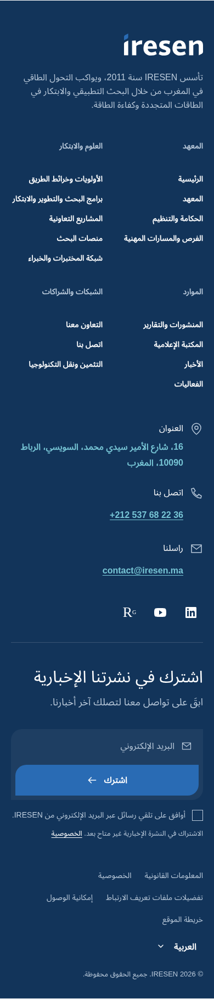

# Footer implementation

The footer adapts the supplied Footer.png composition: a full-width navy surface,
reversed supplied identity, four institutional navigation groups, a contact and
social row, a separated newsletter CTA, utilities, copyright and language
switching. It uses the existing brand tokens, a wider footer-specific content
area, fluid gutters and physical top-left/bottom-right button corners. Two
navigation columns remain available on mobile; contact details and newsletter
controls stack. Arabic uses logical alignment, isolated Latin identifiers,
mirrored directional arrows and no added
letter spacing. The component stays server rendered except for the existing
language selector's progressive keyboard/outside-dismiss enhancements.

## Reference rework — 2026-10-08

The native `.fig` analysis was already completed in the preceding reference
increment. Its [committed evidence](references/figma/design-evidence.json)
records footer frame `1584:6681` at 1920 × 798px with a 60px grid offset and
50px grid gutter. The owner reattached Footer.png in this chat, confirming the
visible composition. The native source was decoded offline; this rework does
not claim a native Figma rendering or exact extraction from the PNG.

The identity occupies the first third of the desktop row; four navigation
groups cover institute, science/innovation, resources and collaboration using
approved page IDs. A contact/social row precedes the divider and the prominent
newsletter heading, email field, subscribe button and consent line. The footer
uses a 120rem maximum with fluid 3.125vw side gutters, clamped to 1.25–4rem,
to retain the broad source composition. The regular 80rem reading width stays
the default elsewhere. Responsive stacking and Arabic behavior are implemented
adaptations rather than layouts verified from the attached desktop export.

Current approved colors, delivered SVGs, contact information, social destinations
and institutional routes take precedence over historical screenshot content.
The reference remains outside public application assets.

Footer destinations must also work without JavaScript. The locale-wide streamed
loading boundary was removed because its deferred page content could remain
hidden without the script that reveals it. Public pages now render their resolved
content directly; existing native navigation and language controls retain their
progressive enhancements.
Unknown-page content also renders directly in its requested locale, with the
existing proxy retaining HTTP 404 and non-indexing headers.

## Content and sources

The owner authorized public information from www.iresen.org on 2026-10-08 and
limited networks to LinkedIn, YouTube and a scientific destination such as
ResearchGate. The main website returned HTTP 403 during inspection. Public
IRESEN documents, its LinkedIn profile and corroborating institutional sources
were used instead. Copy is paraphrased and provided in French, English and Arabic;
editorial review still applies before publication. The owner subsequently confirmed
the move to iresen.ma; the footer retains the general contact alias on that domain.

| Content                                                                   | Public source                                                                                                                                                                                                                                                                                                                                                                                                                       | Verification limits                                                                                                                      |
| ------------------------------------------------------------------------- | ----------------------------------------------------------------------------------------------------------------------------------------------------------------------------------------------------------------------------------------------------------------------------------------------------------------------------------------------------------------------------------------------------------------------------------- | ---------------------------------------------------------------------------------------------------------------------------------------- |
| Founded in 2011; applied research, renewable energy and energy efficiency | [IRESEN LinkedIn profile](https://www.linkedin.com/company/iresen/) and [IRESEN terms of reference, July 2024](https://iresen.org/wp-content/uploads/2024/07/ToR-local-consultant-Version-finale-V02.pdf)                                                                                                                                                                                                                           | Concise summary, with no copied historical figures or commitments from the design screenshot.                                            |
| 16, rue Amir Sidi Mohamed, Souissi, Rabat 10090, Morocco                  | [IRESEN LinkedIn profile](https://www.linkedin.com/company/iresen/)                                                                                                                                                                                                                                                                                                                                                                 | Street name retained in French for Latin locales; Arabic transliteration provided.                                                       |
| +212 537 68 22 36                                                         | [IRESEN Green Africa Innovation Booster contact page](https://www.greenaib.com/contact.html) and [CDTI joint-call document](https://www.cdti.es/sites/default/files/2023-05/47012_301030102020102516.pdf)                                                                                                                                                                                                                           | Actual telephone link, isolated LTR in Arabic.                                                                                           |
| contact@iresen.ma                                                         | Owner’s confirmation of the move to iresen.ma on 2026-10-08, following the documented contact@iresen.org alias.                                                                                                                                                                                                                                                                                                                     | Updated to the owner-confirmed domain; mailbox delivery has not been tested.                                                             |
| LinkedIn                                                                  | [IRESEN LinkedIn profile](https://www.linkedin.com/company/iresen/)                                                                                                                                                                                                                                                                                                                                                                 | Verified institutional profile.                                                                                                          |
| YouTube                                                                   | [Royal Scientific Society/NERC report, prepared for Friedrich Ebert Stiftung, references p. 94](https://kh.aquaenergyexpo.com/wp-content/uploads/2023/08/%D8%A7%D9%84%D8%B7%D8%A7%D9%82%D8%A9-%D8%A5%D9%84%D9%8A-x-%D9%81%D8%B1%D8%B5-%D8%A7%D8%B3%D8%AA%D8%AE%D8%AF%D8%A7%D9%85-%D8%A7%D9%84%D9%87%D8%AF%D8%B1%D9%88%D8%AC%D9%8A%D9%86-%D8%A7%D9%84%D8%A3%D8%AE%D8%B6%D8%B1-%D9%81%D9%8A-%D8%A7%D9%84%D8%A3%D8%B1%D8%AF%D9%86.pdf) | Identifies channel UC_EhFvR6oR3v_Ljta_K3PJw as IRESEN. Direct YouTube retrieval was throttled; reconfirm the channel before publication. |
| ResearchGate                                                              | [IRESEN institutional directory](https://www.researchgate.net/institution/Institut-of-Research-in-Solar-Energy-and-New-Energies)                                                                                                                                                                                                                                                                                                    | ResearchGate aggregates this directory; it is not represented as an institution-managed account.                                         |

Shared contact/network destinations live in `src/lib/footer.ts`. Institutional
copy, address, contact labels and accessible names live in the complete
`Footer` UI catalogs. Institutional and utility links use centrally localized
page identifiers. The footer introduces no CMS schema or external embeds.

The owner explicitly requested the newsletter CTA and chose to keep the form
visible until signup is configured. Email, consent and subscribe controls are
visible but disabled, with a localized unavailable notice and privacy link.
There is no subscription provider, endpoint, data storage or success message.
Current contact-page availability remains governed by the existing contact adapter.

## Earlier verification

Run the standard lint, type, unit, integration and production-build checks, then
`PLAYWRIGHT_EXECUTABLE_PATH=/usr/bin/chromium pnpm test:e2e`. Footer coverage checks
localized navigation, contact/social destinations, 320/768/1440px containment,
Arabic order/alignment, keyboard language selection, supported anchors and
navigation without JavaScript. Existing homepage accessibility tests cover all
three languages, including footer contrast and landmarks.

Before the reference rework, validation on 2026-10-08 passed lint, strict types,
formatting, 8 unit tests, 4 CMS integration tests, the production build and
18 browser tests (7 footer
tests plus the 11 existing foundation tests). Local visual previews cover French
and Arabic desktop/mobile and English tablet. The build reports the existing
next-intl webpack cache-dependency warning on the initial cold build; the final
incremental build compiled without warnings.

## Earlier review screenshots

These screenshots were generated from the earlier verified local production
application on 2026-10-08. They contain only the public footer UI and institutional
contact information. They are review artifacts, not application assets or supplied design
references.

## Design workflow refinement

On 2026-10-08, before the reference rework, the owner requested integration of
flexible design guidelines and a refinement of the UI. That footer used 14px group
labels and utility links, 16px body/desktop links and regular navigation weight.
Mobile navigation links retained a 14px role. The primary contact action was
separated from grouped news/transfer links, and a divider introduced utilities.
Shared rem tokens support text enlargement; long labels can wrap. Content, destinations and
the approved physical brand corners are preserved. The header also has clearer
current-language/menu states and a balanced, wrapping mobile control row.

Validation passed lint, formatting, strict types, 8 unit tests, 4 local CMS
integration tests, a production build and all 18 existing browser tests, including
FR/EN/AR axe checks, footer containment, keyboard navigation and no-JavaScript use.
An additional rendered check covered open navigation in all three locales at
320/390/768/1024/1440px and 200% root text enlargement at 320/1440px: all 21 cases
fit the viewport. Reduced motion was checked. French desktop, Arabic mobile and
English tablet production captures were visually inspected. The final incremental
build compiled without warnings; the initial cold build reported the previously
documented next-intl webpack cache warning. Other browsers and manual screen-reader
coverage were not exercised in this pass; automated scans do not establish conformance.

The workflow itself was checked for 10 valid skill frontmatters, working local
links, task routing, 66 matching pinned upstream Git blob/SHA-256 hashes, 9 local
skill/metadata hashes, valid JSON/YAML and launcher shell syntax. Vendor source is
excluded from formatting/application linting. No Impeccable engine, detector hook
or browser extension was activated.

These captures show the earlier local production footer after that refinement:

## Reference rework verification — 2026-10-08

Lint, strict types, formatting, 8 unit tests, 4 local CMS integration tests,
the production build and all 19 browser tests passed. Browser coverage includes
the disabled newsletter state, localized destinations, Arabic reading order,
keyboard language access, no-JavaScript navigation, FR/EN/AR axe scans and
localized HTTP 404 responses for ordinary and dotted unknown paths.

All 21 rendered cases fit: FR/EN/AR at 320/390/768/1024/1440px, plus 200% root
text at 320/1440px with language options open. French desktop at 1920/1440px,
Arabic mobile at 390px and English tablet at 768px were visually inspected.
The 1920px footer has the source's 60px side offsets; logo geometry and local
asset loading are correct. Reduced motion and keyboard dismissal were checked.
The final incremental build compiled without warnings; the initial cold build
reported the existing next-intl cache warning. Other browsers and manual
screen-reader review remain outside this pass.

These public review captures show the reworked footer:

