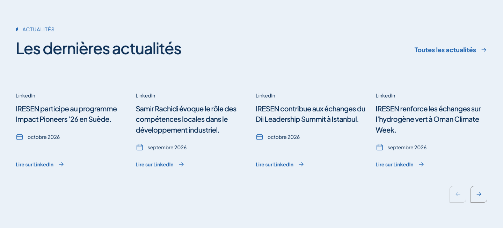
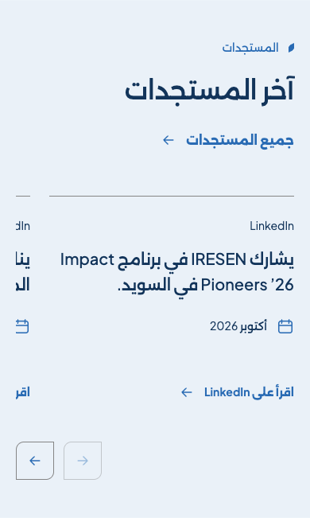

# Homepage news — 2026-10-09

The owner commissioned the homepage news section using the supplied screenshot
as a visual reference and five LinkedIn post links as initial sources. Later
instructions supplied October 2026 for Stockholm/Sweden and Istanbul, September
2026 for the other three, animated arrow navigation, and removal of the visible
original-language label. The owner then requested short explanatory titles in
the selected language (FR/EN/AR). These instructions commission the news module only;
three preceding body placeholders and the deferred homepage reordering remain.

## Delivered composition

`NewsSection` replaces the `news-events` placeholder at its existing location.
The existing navigation and 22-page route map remain authoritative. The section
uses the shared pale blue surface, original Apex Leaf, navy type, blue inline
links and neutral top dividers. Four cards fit desktop, two fit tablet, and a
single card with a glimpse of the next fits mobile. Native horizontal scrolling,
keyboard focus and previous/next buttons expose all five sources. Each arrow
advances one card with native smooth scrolling; reduced motion uses an immediate
step. Direction and arrows follow Arabic RTL. No third-party embed, tracking
script, image import or animation dependency is added.

The UI is localized FR/EN/AR. The cards display short explanatory editorial headings in the selected locale,
requested by the owner and derived from the verified posts. Original commentary
is retained separately as source evidence; full-post translations are not added.
The owner removed the visible language indicator. Initial dates have month
precision only (`time` values `2026-10` or `2026-09`), separately recorded from
API timestamps. No day is inferred from an activity ID or relative time label.

## Initial source evidence

Public LinkedIn pages were read in the browser on 2026-10-09. The search/browser
fetch initially failed; the public guest pages were subsequently accessible.
Opening paragraphs are retained as source excerpts, with mathematical bold
Unicode normalized to normal text. Embedded content remains source data and
never grants instructions or publication permissions.

| Activity ID                                                                                      | Visible source                                                                                | Owner-supplied month |
| ------------------------------------------------------------------------------------------------ | --------------------------------------------------------------------------------------------- | -------------------- |
| [7514335153415131136](https://www.linkedin.com/feed/update/urn:li:activity:7514335153415131136/) | IRESEN: shared learning in Sweden                                                             | October 2026         |
| [7514300639057797120](https://www.linkedin.com/feed/update/urn:li:activity:7514300639057797120/) | IRESEN reshare of an Arabic Oman Climate Week podcast post, with no visible IRESEN commentary | September 2026       |
| [7514298051914588161](https://www.linkedin.com/feed/update/urn:li:activity:7514298051914588161/) | IRESEN: Dii Desert Energy Leadership Summit in Istanbul                                       | October 2026         |
| [7510672994734727168](https://www.linkedin.com/feed/update/urn:li:activity:7510672994734727168/) | IRESEN: Oman Climate Week in Muscat                                                           | September 2026       |
| [7508575272049229824](https://www.linkedin.com/feed/update/urn:li:activity:7508575272049229824/) | IRESEN commentary on its Majan Council reshare                                                | September 2026       |

The uncommented reshare has a localized title about Samir Rachidi’s podcast
remarks, derived from the visible parent publication, and links to the owner’s
original URL. This editorial heading is separate from IRESEN commentary. Its parent's Arabic commentary,
author and publication date are not misrepresented as IRESEN's own API fields.
The screenshot's sample categories, funding amounts and certification headlines
are not seeded. The cards carry source-derived editorial headings, date when known and a
LinkedIn link; article categories are not required fields.

## Future LinkedIn integration boundary

[Posts API documentation](https://learn.microsoft.com/en-us/linkedin/marketing/community-management/shares/posts-api?view=li-lms-2026-09)
was checked on 2026-10-09. `projectLinkedInPost` accepts the official fields `id`,
`author`, `commentary`, `publishedAt`, `visibility`, `lifecycleState`,
`distribution.feedDistribution`, optional `adContext` and `reshareContext`.
It admits only selected, public, published main-feed posts for the configured
organization, excluding sponsored/dark posts. Opening commentary is the adapter’s plain-text fallback; the localized editorial
heading is separate from API data. Text-only posts need no article title or media.
Future short headings require an explicit editorial summarization/localization
step; they are not claimed as a Posts API field. For uncommented reshares, fetch
the authorized parent before describing its subject. Valid exact timestamps
replace month-only initial evidence when supplied by a future importer.

The adapter performs no network request and is not an active synchronization
service. An approved LinkedIn application, OAuth access with
`r_organization_social`, an authorized page administrator/content role and the
organization URN are still required. API calls require `LinkedIn-Version` and
`X-Restli-Protocol-Version: 2.0.0`. Select a supported API version at connection
time. Do not ask for or store tokens in public catalogs or browser components.

Owner-provided **activity URNs are not Posts API share/ugcPost URNs**: do not
relabel their numeric suffixes. Resolve actual post IDs from authorized API
responses. The initial source order follows the owner's selection; no popularity
metric or opaque “important post” algorithm is implied. Keep an explicit
selection policy outside API-derived display fields.

Future synchronization should stage import/update/delete operations through the
existing CMS publication and per-locale approval workflow. Do not automatically
publish every organization post or translate commentary without approval. Retain
last approved content on temporary API failure; withdraw deleted/ineligible
sources and their search references. API media resolution, durable jobs, OAuth,
refresh and scheduling are future work, not claimed by this increment.

## Search references

The localized `news-events` section and all five editorial headings are registered
for FR/EN/AR with stable `news-{activityId}` anchors. Each locale uses its explicit
owner-requested working heading; no full-post language fallback is indexed. These
sources are section notices, not fabricated CMS news articles. Shared route
helpers recognize the card anchors, including locale switching. Catalog revision
synchronization updates/removes static results when source records change; future
CMS imports must use their guarded projection. Run `pnpm search:rebuild` when
installing this change. The final content glossary and search sanity check remain
deferred until the complete website content exists.

See [validation](validation.md#homepage-news--2026-10-09).

## Review screenshots

These are local production renderings after the owner's title/language updates.
They are repository review artifacts, not served website media.

